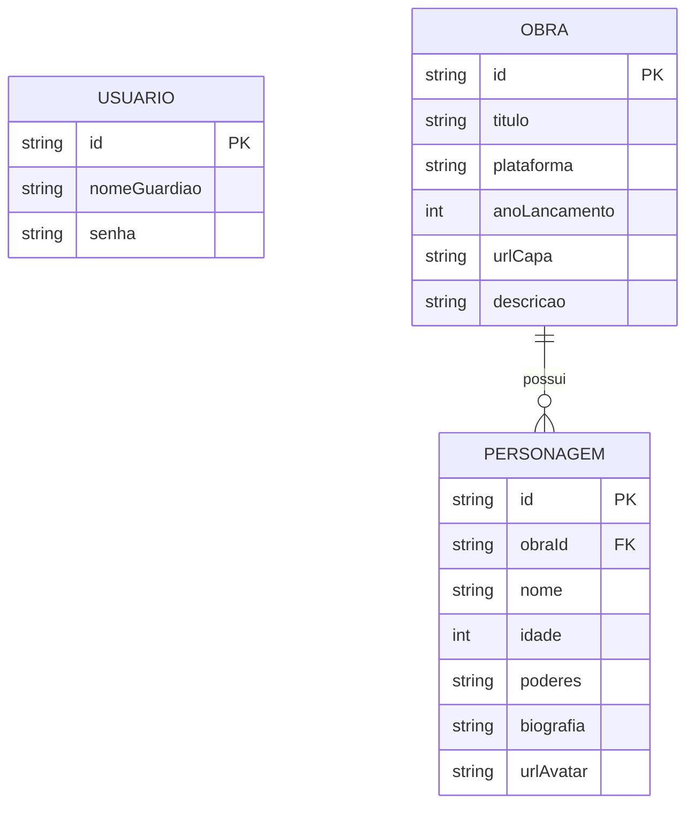

# 🛠️ Especificação Técnica (Tech Spec) - NPCRealm

Este documento detalha a arquitetura técnica inicial e o modelo de dados necessários para o funcionamento do NPCRealm, estruturando como o sistema armazenará e relacionará os dados das obras e seus personagens.

## 1. Modelo de Dados (Diagrama ER)

Abaixo está o Diagrama Entidade-Relacionamento (DER) que representa a estrutura do "banco de dados" (`db.json`) e como as informações se conectam dentro do reino.



2. Dicionário de Dados

Breve explicação das tabelas principais e seus atributos:

    Usuários (Guardiões/Cronistas): Responsável por armazenar as credenciais de acesso ao sistema.

        id: Identificador único.

        nomeGuardiao: Chave de acesso do usuário no login.

        senha: Credencial de autenticação.

    Obras (Jogos): Entidade central do catálogo. Armazena os dados dos jogos forjados/cadastrados no sistema.

        id: Identificador gerado automaticamente.

        urlCapa: Link ou caminho local (relativo) para exibir a imagem na Grid do Bootstrap.

    Personagens (Elenco): Registra os membros da história. Regra de Negócio Crítica: Todo personagem deve obrigatoriamente pertencer a uma Obra.

        obraId: Chave estrangeira que vincula o personagem ao seu jogo de origem. Permite que o sistema filtre o elenco correto ao abrir o "Pergaminho da Obra".

        urlAvatar: Imagem focada no rosto, renderizada na interface com a classe rounded-circle do Bootstrap.

3. Rotas da API (JSON Server)

A aplicação consumirá os dados via API local simulada. Abaixo os principais endpoints previstos:

    GET /obras - Retorna a lista completa de jogos para exibir no Salão Principal.

    POST /obras - Rota acionada pela "Forja" para cadastrar um novo jogo.

    GET /obras/{id} - Retorna os detalhes de um único jogo selecionado.

    GET /personagens?obraId={id} - Retorna apenas o elenco vinculado à obra específica.

    GET /personagens/{id} - Retorna o dossiê detalhado de um único personagem.

4. Estrutura do Banco de Dados (db.json)

Esta é a representação em formato JSON do banco de dados simulado, servindo de base para o desenvolvimento do Front-end e para a estruturação do LocalStorage ou JSON Server.
JSON

{
"usuarios": [
{
"id": "1",
"nomeGuardiao": "Aldous",
"senha": "senha_antiga"
}
],
"obras": [
{
"id": "1",
"titulo": "Final Fantasy VII Remake",
"plataforma": "PlayStation 5",
"anoLancamento": 2020,
"urlCapa": "img/capas/ff7.jpg",
"descricao": "A cidade de Midgar é controlada pela megacorporação Shinra..."
}
],
"personagens": [
{
"id": "1",
"obraId": "1",
"nome": "Cloud Strife",
"idade": 21,
"poderes": "Manejo da Buster Sword, Magia Materia",
"biografia": "Um ex-SOLDIER de primeira classe que se tornou mercenário em Midgar.",
"urlAvatar": "img/avatares/cloud.jpg"
},
{
"id": "2",
"obraId": "1",
"nome": "Aerith Gainsborough",
"idade": 22,
"poderes": "Magia Branca, Comunicação com o Planeta",
"biografia": "A última dos Cetra, uma raça ancestral com fortes laços com a magia do planeta.",
"urlAvatar": "img/avatares/aerith.jpg"
}
]
}

```

```
